<h1>
    
     Análise de Sentimentos com Azure Language Studio
</h1>

Repositório criado para treinamento de aprendizado de mais uma funcionalidade do Azure AI, preparatório para a certificação Microsoft Azure AI Fundamentals (+AI-900).

---

## Analyze sentiment and mine opinions
Através deste recurso a Inteligência Artificial analiza textos afim de descobrir o sentimento e satisfação do usuário que o escreveu, assim como as principais opiniões.

Para esse projeto criei um texto, artigo sobre InteligÊncia Artificial, de forma que informativa, mas que de acorodo com o texto, pudesse deixar o leitor com dúvidas quanto ao direcionamento de ideia que o redator deixou com o texto, se o artigo apresenta-se de forma positiva ou negativa com a IA. TExto foi criado através ferramenta de IA, o Copilot, utilizando um prompt a solicitar tal artigo com as informações e direcionamentos que o texto devesse proporcionar aos leitores.

## Passo-a-Passo 🎯

### 01 - Dentro do Language Studio guia *Classify test* clique na opção Analyze sentiment and mine opinions:   
 
...
 
...
 
...

### 02 - Análise do texto, dividido por sentenças (partes do texto) e apresentando o texto original por completo:

<b>* Sentence 01</b>
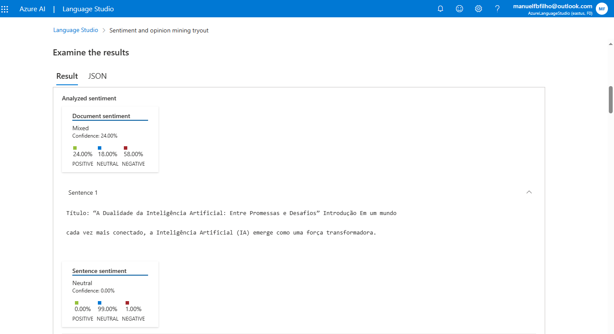

---
<b>* Sentence 02 e 03</b>
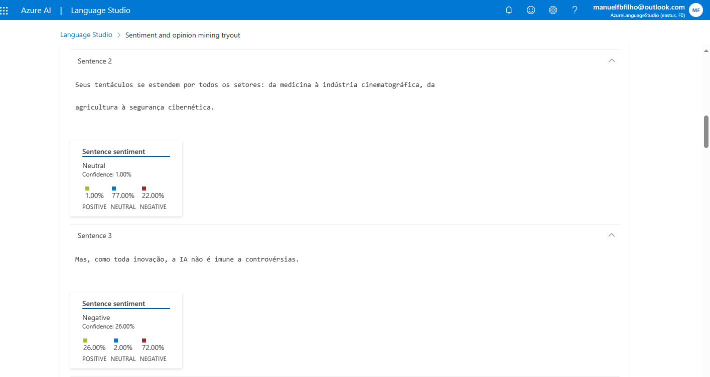 

---
<b>* Sentence 04 e 05</b>
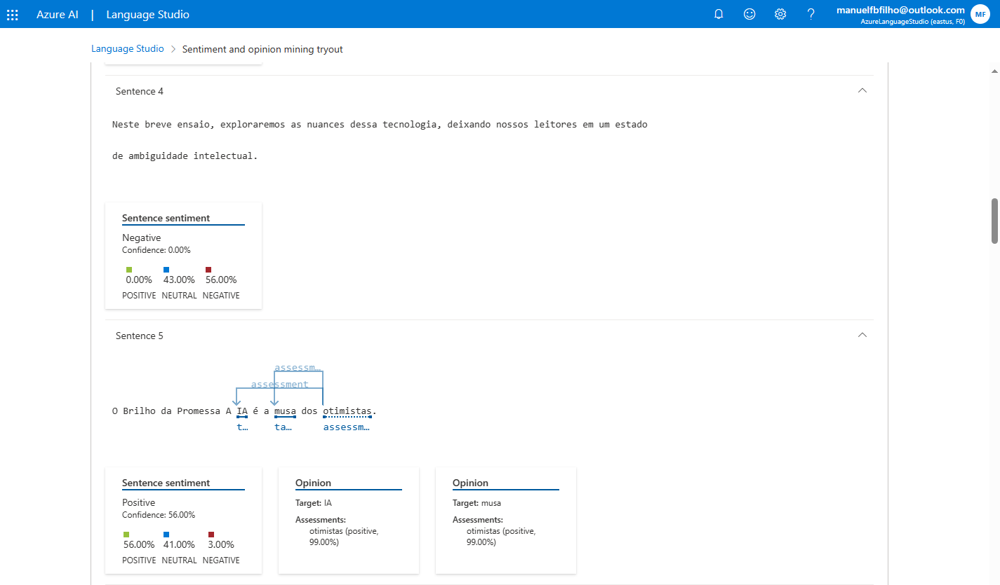 

---
<b>* Sentence 06 e 07</b>
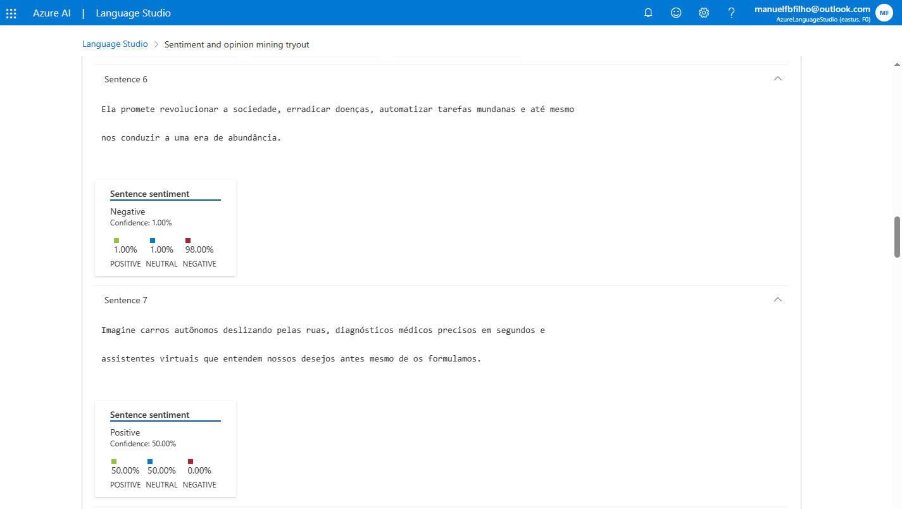 

---
<b>* Sentence 08 e 09</b>
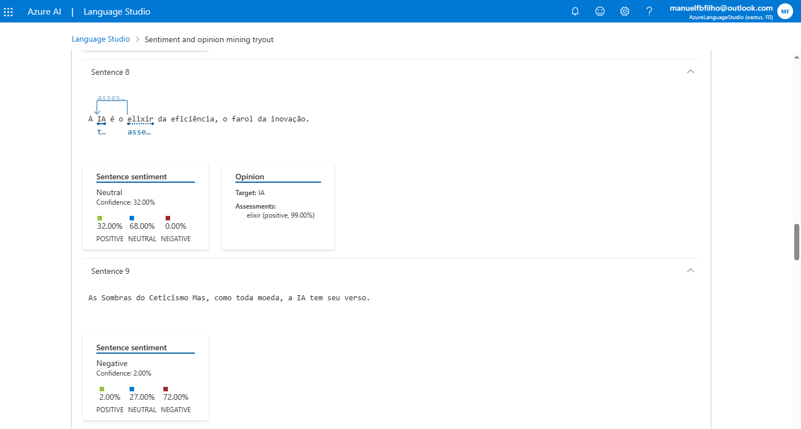 

---
<b>* Sentence 10 e 11</b>
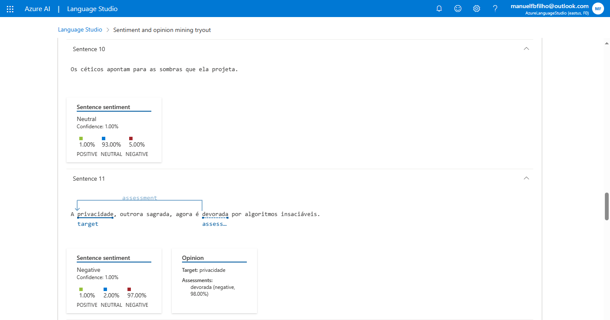 

---
<b>* Sentence 12 e 13</b>
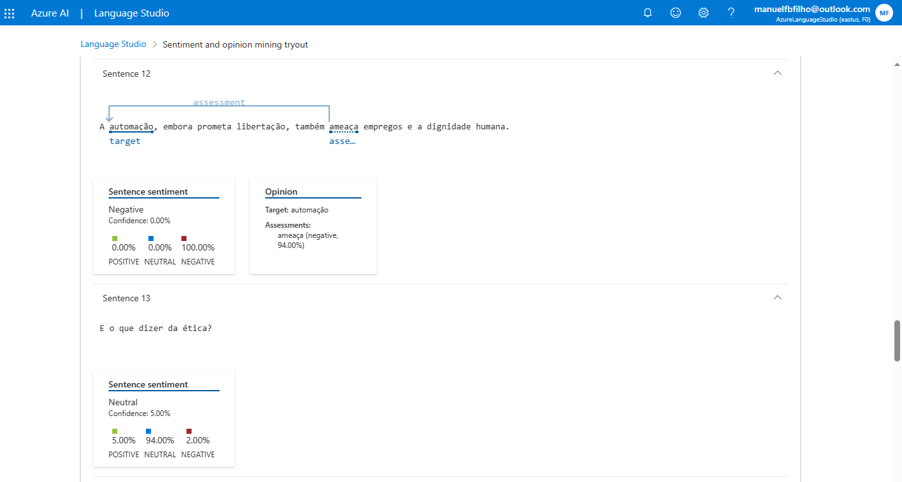 

---
<b>* Sentence 14 e 15</b>
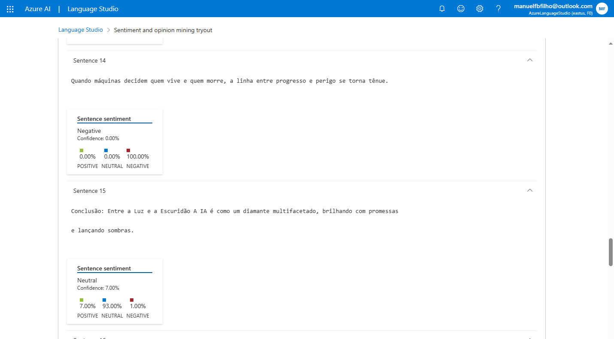 

---
<b>* Sentence 16 e 17</b>
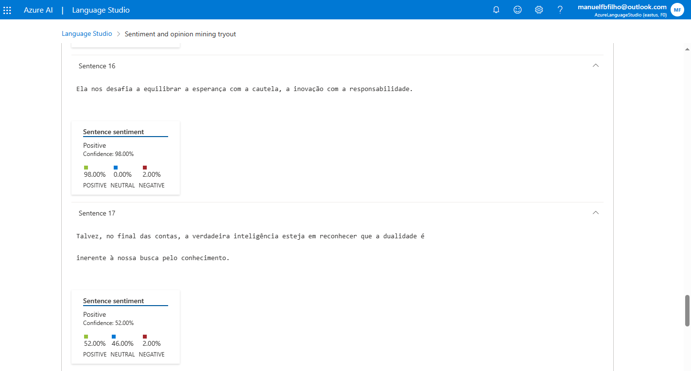 

---
<b>* Sentence 18</b>
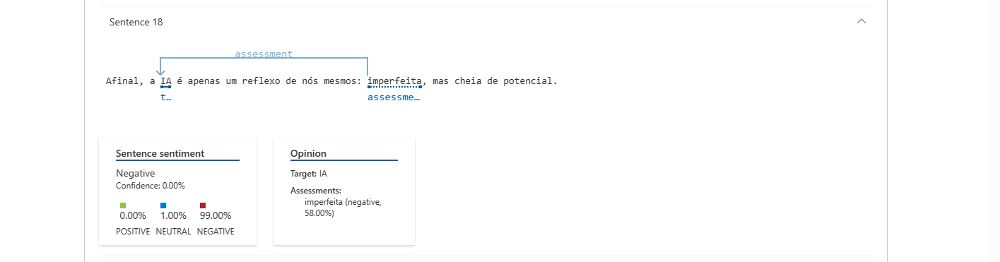 

---
<b>* Texto original - Analisado de Forma Completo</b>
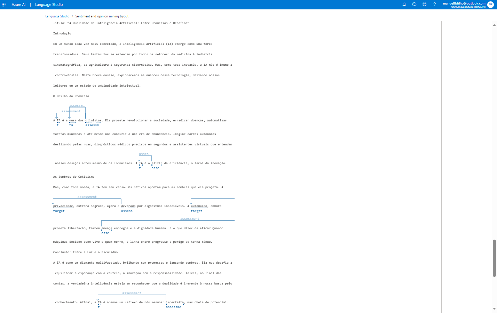 
...

## Considerações Finais  

   Tal recurso, de forma comercial, facilita bastante o dia da dia das empresas, uma vez que possibilita saber de forma ágil e simples o sentimento dos clientes no que diz respeito aos seus produtos, o que eles mais gostaram, menos gostaram e a possibilidade de voltarem a consumir o produto ou serviço, possibilitando assim a reação rápida por parte da empresa. Também importante para análise de textos, artigos, reportagens, afim de compreender posicionamentos e tendenciosidades que o escritor pretende para com seus leitores.

---

## Contatos 

 

